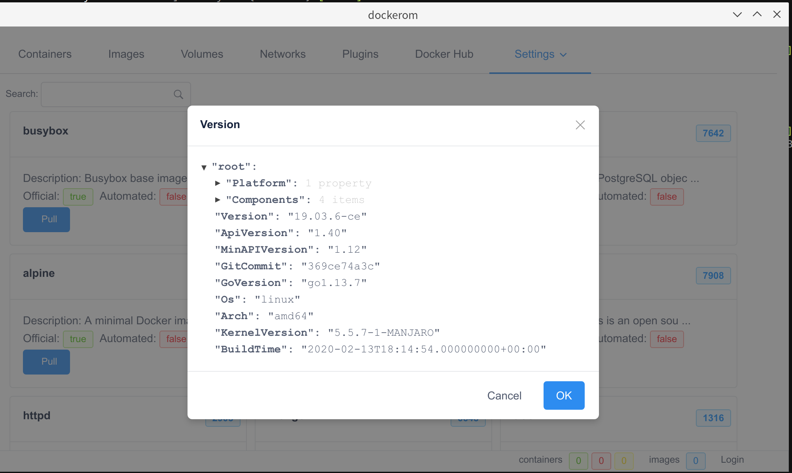

## dockerom

> manager your docker images and containers in local machine


This is a upgrade for [`dockeron`](https://github.com/dockeron/dockeron)

Electron: 8.1.1

A dockeron project, built on Electron + Vue.js for Docker.
  - Template generator: [electron-vue](https://github.com/SimulatedGREG/electron-vue)
  - Docker Engine API: [dockerode](https://github.com/apocas/dockerode).
  - UI components: [iView](https://github.com/iview/iview)
  - Dockeron project: [dockeron](https://github.com/dockeron/dockeron)

*I am only using Manjaro, which means that the Windows,Mac and other Linux versions are to be tested.*

*Mac Version will be tested later*

*Notice that, this project is still under active development, many functionalities or features are not implemented yet, and some parts are still buggy.*


## Screenshots





## Development

Make sure you have Node.js installed (node@^v13.9.0 or higher is recommended).

- Clone the repo to your machine (or fork it to your github account then clone from there)
```
git clone https://github.com/badwolfbay/dockerom.git
cd dockerom
```

- Make your branch from `develop`

- Install all dependencies then `npm run dev`

```
npm install
npm run dev
```

---

This project was generated with [electron-vue](https://github.com/SimulatedGREG/electron-vue) using [vue-cli](https://github.com/vuejs/vue-cli). Documentation about the original structure can be found [here](https://simulatedgreg.gitbooks.io/electron-vue/content/index.html).
